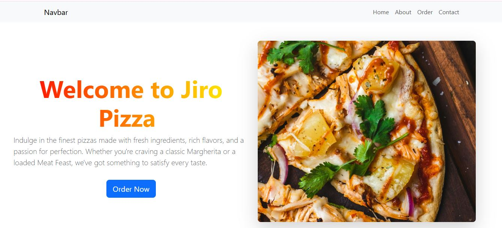
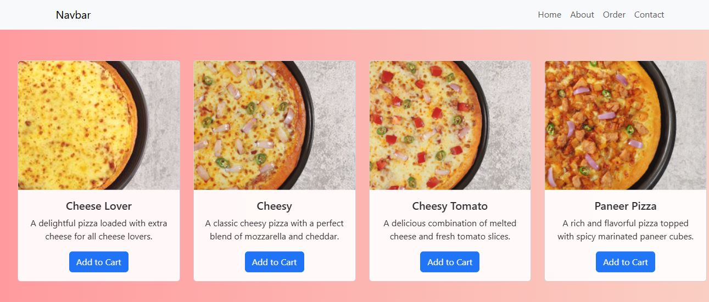
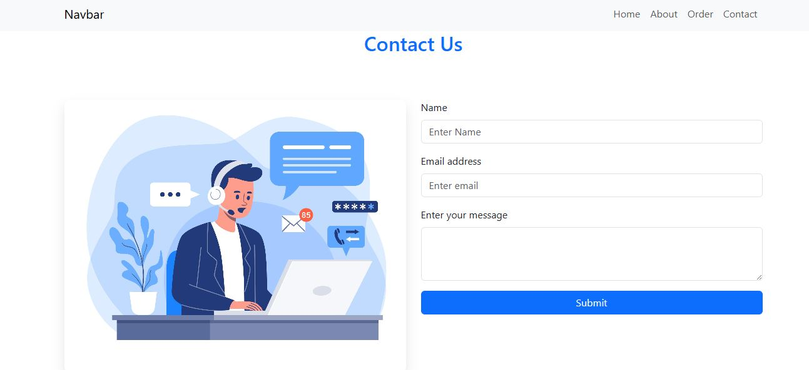

# 🚀 React simple website

This is a **React** project bootstrapped with **Vite**. It includes various pages such as **Home**, **About**, **Contact**, and **Order Page** for a pizza ordering website. The project is built using modern technologies like **React** for the frontend and features smooth animations using **GSAP**.

## 🗂 Pages in the Project

- **🏠 Home**: A welcoming page with a hero section and animated typewriter effect.
- **ℹ️ About**: A page that describes the company and its mission.
- **✉️ Contact**: A contact form to allow users to get in touch with the business.
- **🍕 Order Page**: A dynamic page displaying available pizza items, where users can add items to the cart.

## ✨ Features

- **🎥 Smooth scroll animations** with **GSAP** and **ScrollTrigger** for smooth entry and fade-in effects as users scroll down the page.
- **📱 Responsive Design** to ensure the app looks great on all screen sizes.
- **⌨️ Typewriter Effect** on the home page to enhance user engagement.
- **✔️ Form Validation** using **React-Bootstrap** for smooth user interaction.

## 📸 Project Screenshot

